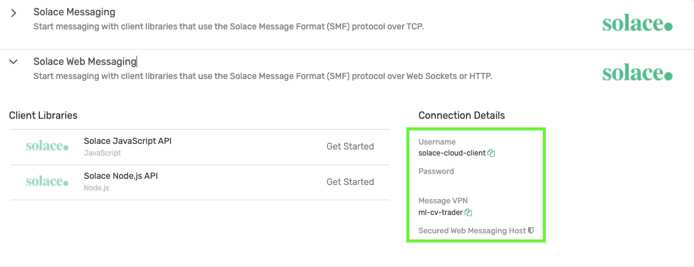

# entangled-cannon

An experimental app that explores using event driven architecture to build interactive 3D experiences for the web. The project is built on a few core technologies and frameworks:

   * [Svelte](https://svelte.dev): A javascript framework that uses a compilation step to create compact web applications that run blazingly fast.
   * [Threlte](https://threlte.xyz): A library for svelte heavily inspired by [react-three-fiber](https://github.com/pmndrs/react-three-fiber) that allows you to easily build interactive 3D applications using [Three.js](https://threejs.org)
   * [Solace PubSub+ Cloud](https://solace.cloud): Enterprise grade messaging that facilitates communication between the phone and the web application


Everything you need to build a Svelte project, powered by [`create-svelte`](https://github.com/sveltejs/kit/tree/master/packages/create-svelte).


## Developing

Once you've created a project and installed dependencies with `npm install` (or `pnpm install` or `yarn`), start a development server:

```bash
npm run dev

# or start the server and open the app in a new browser tab
npm run dev -- --open
```

## Running this locally

To run this application you will need to enter a few configuration items. First, rename [`.env.example`](.env.example) to `.env`. 

In the configuration file, you will see the following properties that relate to [Solace Cloud](https://solace.cloud):
```
VITE_SOLACE_URL= 
VITE_SOLACE_VPN= 
VITE_SOLACE_USER= 
VITE_SOLACE_PASSWORD=
``` 
These configurations can be retrieved by signing up for a FREE [Solace Cloud](https://solace.cloud) Account. From there, you will spin up a Solace Cloud broker by following the instructions [here](https://docs.solace.com/Cloud/ggs_create_first_service.htm). Navigate to the Event Broker Service Connection information and access the details for `Solace Web Messaging` and you will enter the properties you find as detailed here:


In addition, you will notice a property called `VITE_LEADERBOARD_URL`. This is an optional property that is required for the Leaderboard functionality. Its simply an HTTP endpoint that returns JSON in the following format :
```
[{
  initials: string,
  score: number,
  game_session_id: string,
  datetime: string
}]
```

Finally, the way entries are submitted to the leaderboard is through Solace's [RDP (Rest Delivery Point)](https://docs.solace.com/Services/Managing-RDPs.htm) functionality that posts a message from a queue to an HTTP endpoint. Again, this is optional for the main game to function in your own enviornment. Feel free to reach out to me if you would like help getting this all setup.

## Building

To create a production version of your app:

```bash
npm run build
```

You can preview the production build with `npm run preview`.

> To deploy your app, you may need to install an [adapter](https://kit.svelte.dev/docs/adapters) for your target environment.

## Learning more

If you would like to learn more about how exactly this was built - feel free to visit a [blog post](https://tkthetechie.io/blog/event-driven-3d-javscript) I wrote up. 

## Credits

   * Cannon model based on [this model](https://sketchfab.com/3d-models/cannon-4ca9b1f52fcc4d399ee65ed7778cfe30) by [luonro11](https://sketchfab.com/luonro11) licensed under [CC-BY-4.0](http://creativecommons.org/licenses/by/4.0/)
   * Target model based on [PBR Target](https://sketchfab.com/3d-models/pbr-target-ea1bec8a10054369862412c6d451e558) by [zulubo](https://sketchfab.com/zulubo) licensed under [CC-BY-4.0](http://creativecommons.org/licenses/by/4.0/)
   * Music and sound effects downloaded from [Pixabay](https://pixabay.com/)
